## 多人聊天室系统

这是一个从头开始搭建起来的简单的多人聊天室系统，基于flask框架开发，前端使用HTML和一些简单的CSS。

#### 使用方法
1. 安装python环境
2. 运行`pip install -r requirements.txt`
3. 如果需要使用ai聊天功能，在app.py的28行添加你的api密钥，我使用的是 [free_chatgpt_api](https://github.com/popjane/free_chatgpt_api) 提供的免费api密钥
4. 运行`python app.py`

#### 系统使用说明
1. 启动系统，运行app.py，即可在本机上访问，或通过局域网访问。

2. 访问网页，进入登录界面，可点击先进行注册
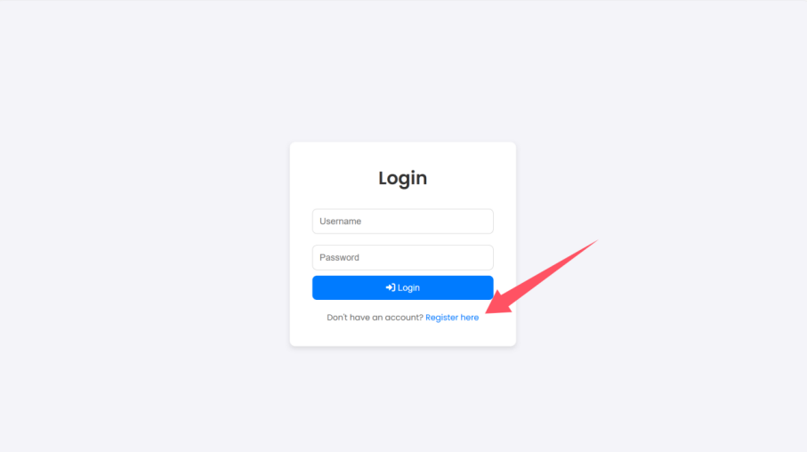

3. 输入用户名和密码进行注册
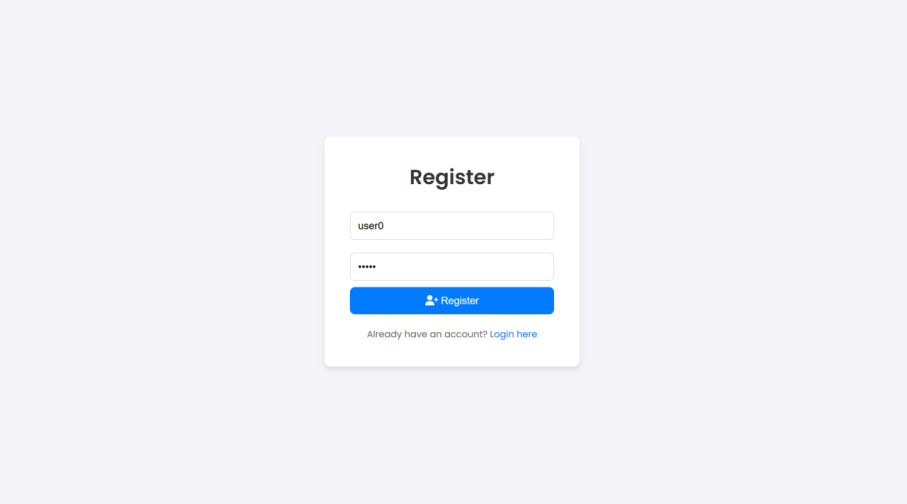

4. 注册成功，自动跳转至登录界面，可进行登录
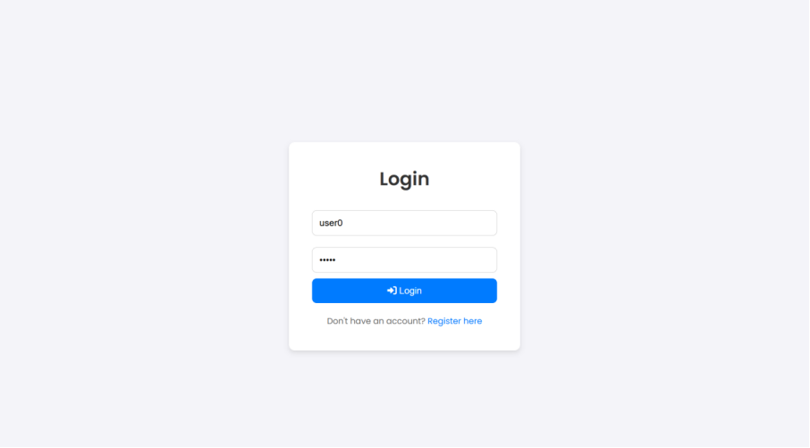
   
5. 登录成功，进入聊天室选择页面，可在此创建新的聊天室
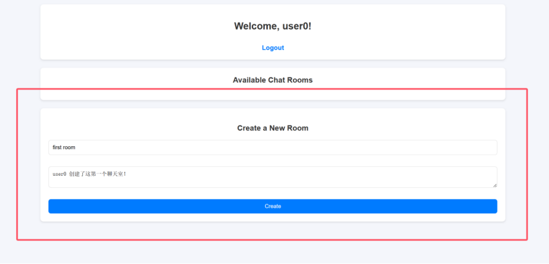

6. 创建成功

7. 点击蓝色的 first room 即可进入聊天室
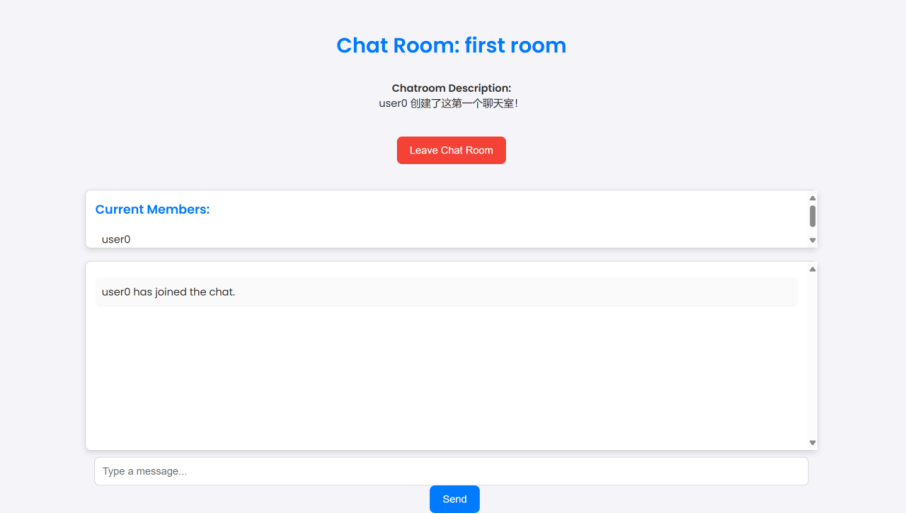

8. 其他用户可看到新的聊天室和聊天室的在线成员
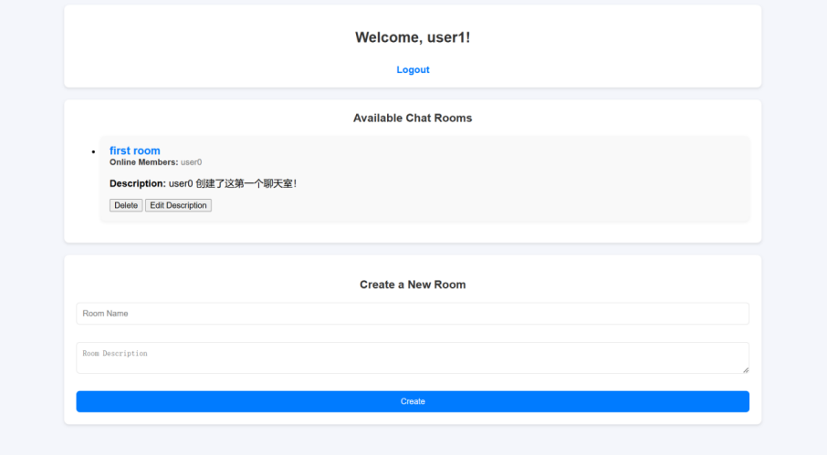

9.  当user1加入后，user0可看到
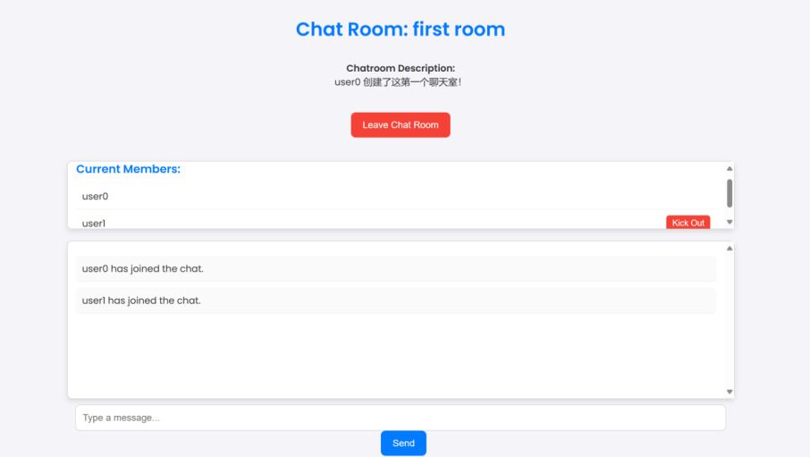

10. 聊天吧！
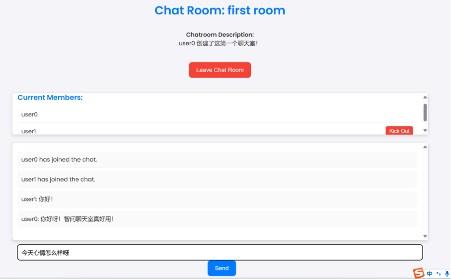

11. 管理员可踢出聊天室的成员
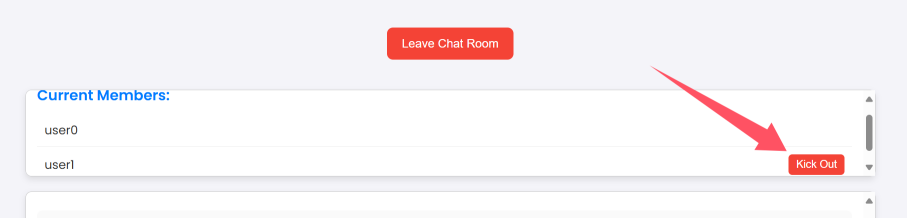
被踢出的成员收到提示并退回至聊天室选择页面
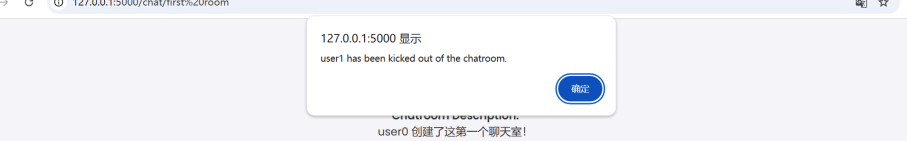

12. 点击下载按键可下载聊天记录
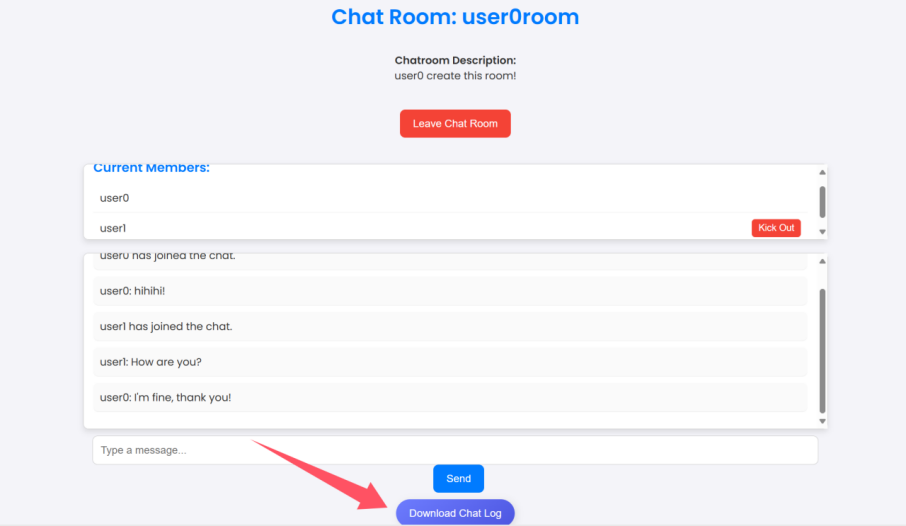

13. 可退出当前聊天室，回到选择聊天室界面
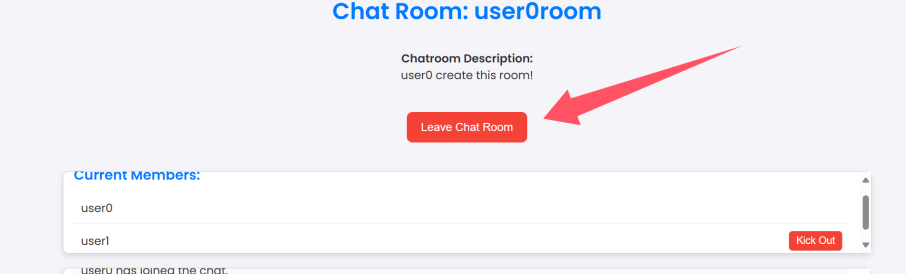

14. 可以点击Edit Description对聊天室的简介进行修改
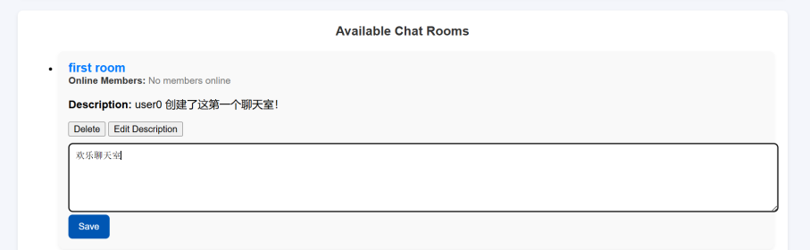

15. 点击logout可退出登录
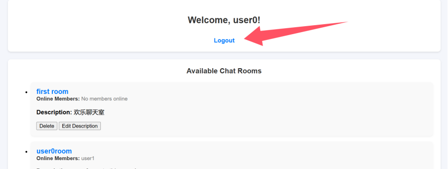

16. 还可以与ai对话！！！在消息前添加@GPT即可向GPT发问！
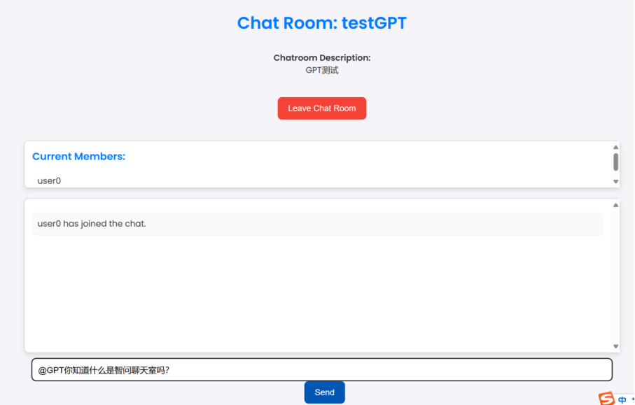

17. 发送后等待GPT回复（目前有阻塞的问题，用户发出消息无法立即显示，要等GPT回复之后才会一起显示）
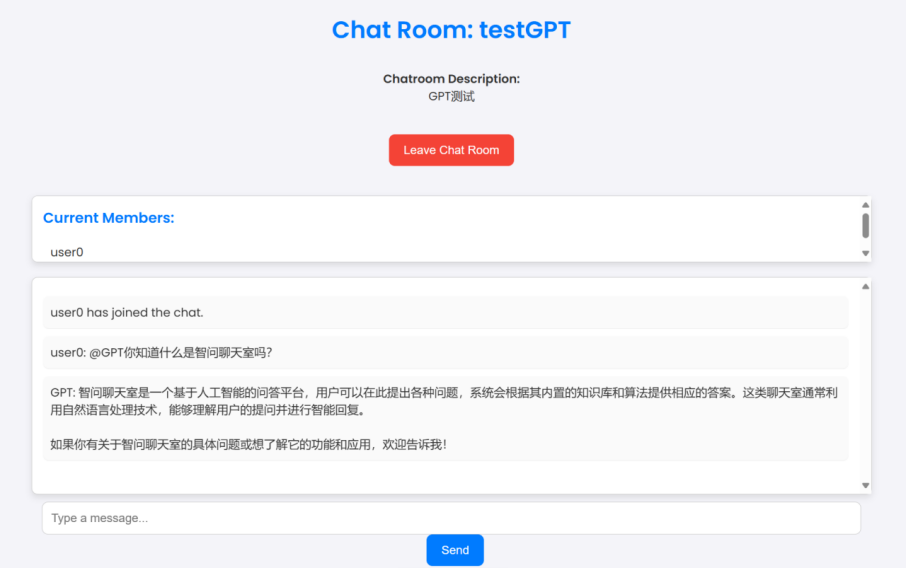